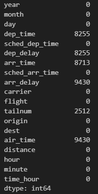
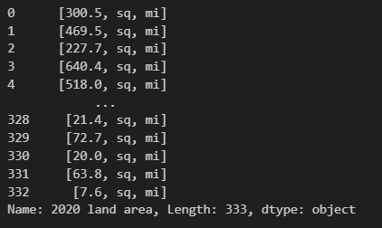
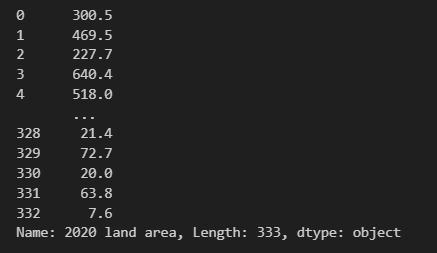

[back](../)

# Cleaning and Manipulating DataFrames in Python: A Comprehensive Guide

Data cleaning is an essential step in any data analysis project. Messy, inconsistent, or incomplete data can lead to inaccurate results and unreliable insights. In Python, one of the most common data structures for data manipulation is the Pandas DataFrame. In this guide, we will explore various techniques and best practices for cleaning DataFrames in Python.

## Table of Contents

1. [Importing Pandas](#1-importing-pandas)
2. [Loading Data](#2-loading-data)
3. [Handling Missing Data](#3-handling-missing-data)
4. [Data Type Conversion](#4-data-type-conversion)
5. [Handling Text Data](#5-handling-text-data)

## 1. Importing Pandas

Before you start cleaning data, you'll need to import the Pandas library. It provides powerful tools for data manipulation, including DataFrames, which are like tables in a database but in Python. By convention, you import it as pd.

```python
import pandas as pd
```

## 2. Loading Data

Pandas offers ways to read multiple different types of files like csv, html, json, excel, and many others. To keep it simple we will use a csv file provided here https://github.com/esnt/Data/raw/main/Flights/flights.csv

```python
df = pd.read_csv('https://github.com/esnt/Data/raw/main/Flights/flights.csv')
print(df)
```

## 3. Handling Missing Data
Missing data is a common issue in real-world datasets. You can identify and handle missing values using methods like isnull(), fillna(), or dropna().

We will look at the number of NA values in the dataset. The isna() function converts each value of the dataframe into TRUE or FALSE based on if it is na or not. Then the sum() function sums all the values of each column. Because TRUE maps to 1 and FALSE maps to 0, this will end up with the total number of na values in each column.

```python
df.isna().sum()
```



There are multiple different reasons there might be NA values in a dataframe. For example, if we look at the missing tail numbers on planes, those are missing probably just because they aren't known. But if there is an NA departure time, that might be because we don't know or more likely because the planes never departed, so the flight was cancelled. So here are some ways we can take care of those. 

This drops the null values in the tailnum column. axis = 0 means that we are looking at columns, subset means the subset of the columns we are looking at, and inplace means that the dataframe will be saved with the null values dropped. 

```python
df.dropna(axis = 0, subset=['tailnum'], inplace=True)
```

Then we can make a new column named cancelled to signify if the flight is cancelled or not based on if the depature delay was NA.

```python
df['cancelled'] = df['dep_delay'].isna()
```

Then we can take the rest of the null values, if they aren't null because it is a cancelled flight, we will fill it with the mean of the other values. 

```python
df.loc[df['cancelled'] == False].copy()['dep_time'].fillna(value=df['dep_time'].mean(), inplace=True)
df.loc[df['cancelled'] == False].copy()['arr_time'].fillna(value=df['arr_time'].mean(), inplace=True)
```
Lets walk through this

```python
df.loc[df['cancelled'] == False].copy()
```
This filters the dataframe to only include the flights that were not cancelled.

```python
['dep_time']
```

This selects only departure time

```python
.fillna(value=df['dep_time'].mean(), inplace=True)
```

This fills all the NA values in that column with the mean of the departure times and saves it inplace.

Congratulations! You took care of all the NA values in the dataframe. 

## 4 Data Type Conversions

Lets say now you wanted to make a date column. We have a YEAR DAY and MONTH column, so we need to combine those. Here are three things you can try. But note only the third one works

```python
df['date'] = df['day'] +  df['month'] + df['year']
df['date'] = str(df['day']) +  str(df['month']) + str(df['year'])

# this one works
df['date'] = df['day'].astype(str) + "-" + df['month'].astype(str) + "-" + df['year'].astype(str)
```

So why don't the first two work? Well the day month and year columns are integers so the first one will just add the numbers together. Ok so lets cast it to a string. But the second one doesn't work because it converts the whole column into a string, instead of each individual row. So you need to call the astype method for pandas. 

Now we can cast that column from a string to a datetime pandas object

```python
df['date'] = pd.to_datetime(df['date'], dayfirst=True)
```
## 5 Handling Text Data

I am going to import some more data for this example
```python
url = "https://en.wikipedia.org/wiki/List_of_United_States_cities_by_population"
tables = pd.read_html(url)
df = tables[4]
```

Text data often requires special attention. You can use string methods like str.lower(), str.strip(), str.get(), and str.replace() to clean text data. For example we want to look at the 2020 land area column which has values in the format like "300.5 sq mi." but we just want the number so we can do calculations.

The first thing to do is to use the str.split() method. This splits a string by a given delimiter, by default this is white space.

```python
df['2020 land area'].str.split()
```
That produces this. Good so we have three different strings now. 


Now we need to get the first string, we don't care about the other ones. We will use str.get()

```python
df['2020 land area'].str.split().str.get(0)
```


Now we need to get rid of those commas, because pandas cannot convert a string to an integer if there are any "string" characters in there. The str.replace() method works for this where the first parameter is what you will be replacing, and the second is the thing to replace it with. So here I am replacing all commas with nothing.

```python
df['2020 land area'].str.split().str.get(0).str.replace(",", "")
```

Now finally you can cast it to a numerical value using pd.to_numeric. And you have great numbers to work with now!

```python
pd.to_numeric(df['2020 land area'].str.split().str.get(0).str.replace(",", ""))
```


That is the basics for cleaning some data! Hope you liked it. 

[back](../)
