# Analyzing Personal Finances: Insights from My Budget Tool

## Introduction

As a part of my personal finance journey, I recently developed a budget tool to track and manage my expenses and earnings. The tool, built using Python and incorporating data visualization libraries, has provided valuable insights into my spending patterns and budget adherence. In this blog post, I'll share some of the key findings and lessons learned from analyzing my financial data.

Here is the link to my [repository](https://github.com/gmspringer32/personal-budget-tool)

Here is the link to my budget [tool](https://personal-budget-tool-bbk8e2wy6vgomi8msuibah.streamlit.app/) (note that this tool uses dummy data)

## The Budget Tool

The budget tool is designed to categorize and visualize both my monthly earnings and expenses. It integrates with my existing budget data, allowing me to compare actual spending against planned budgets. One of the primary features is a graphical representation of monthly earnings, which has proven to be insightful in understanding income distribution across different categories.

## Questions to Answer

While looking at the data I came up with a list of questions to answer.

1. What is my monthly income and in what categories?
2. What are my monthly expenses and what categories?
3. What is my month to month expenses compared to my income over the year?
4. What is my month to month spending in specific categories over the year?
5. Can I make a budget to see where I am over and under spending?

### 1. What is my monthly income and in what categories?

To answer this question, I looked at the data where I gained money into my account. This was difficult because in my checking account this was denoted by a positive number, but in my credit card account, it was a negative amount. But here is what I found.

This is what the top of my budget tool looks like. I crossed out values to keep privacy.

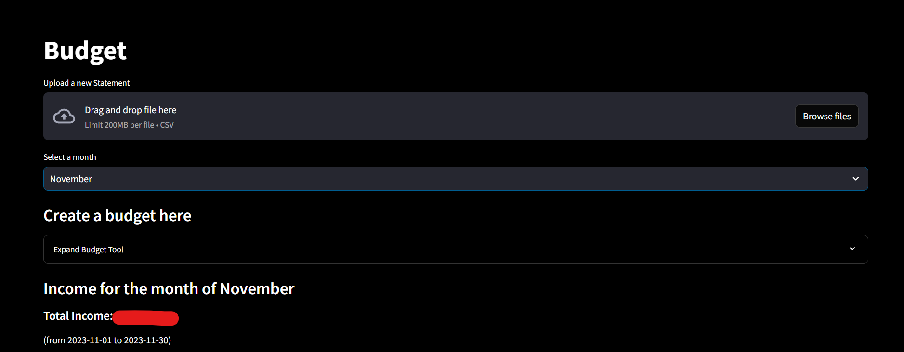

You can sort values by month. You can expand the budget tool as well but we will get into that later. Here is my findings for the month of November.

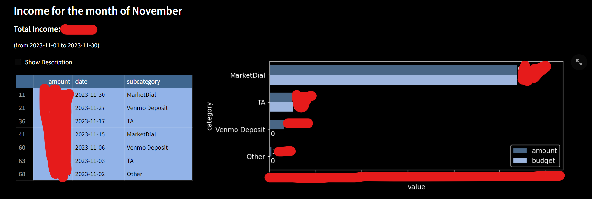

This is pretty much as expected, nothing really out of the ordinary. My wife works full time so she brings in most of the money right now.

### 2. What are my monthly expenses and in what categories?

The biggest questions I had was in regards to my expenses. Here are my findings.

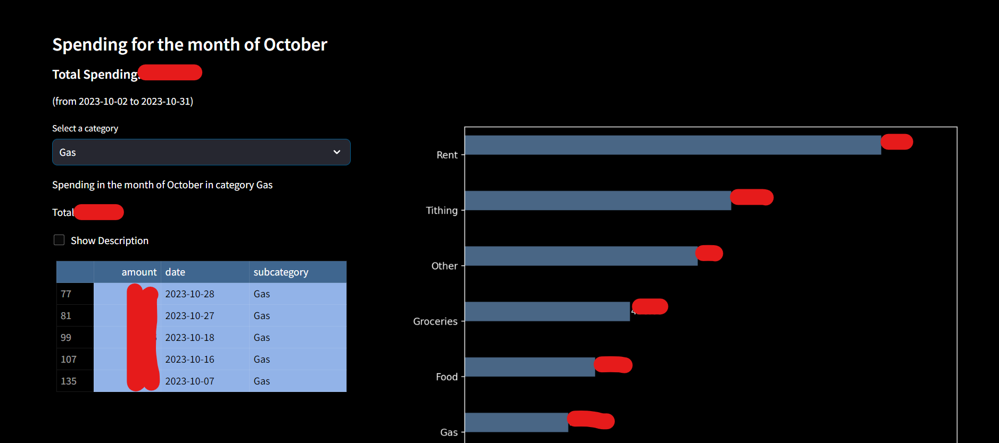

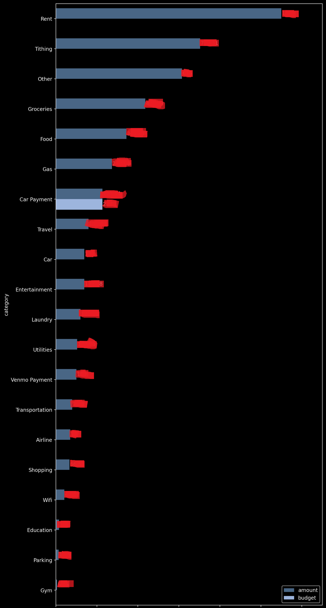

My biggest expense is rent which is not surprising. But it is interesting, something called "other" so I took a look at that

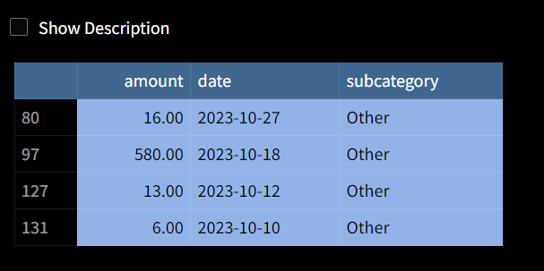

So if I want to look at specifically what I spent over 500$ on I can just click on the show description button.

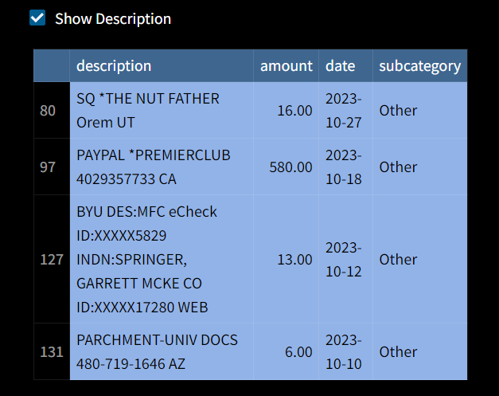

It looks like it was when I payed to play in a soccer league, but I also got venmo payments from all my teammates. So now that makes sense.

### 3. What are my total monthly expenses and monthly income over the year?

Now to look at expenses and income from month to month on the same graph.

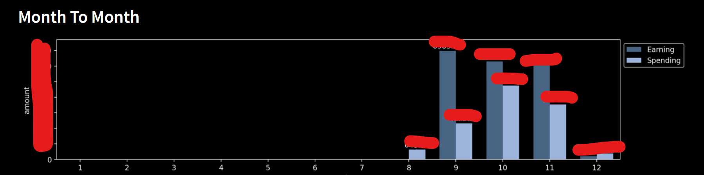

This only includes from august because that is when my wife and I opened our bank account together. It looks like our spending and income is fairly steady over the months. It we had more spending in october than in the other months, we took a couple trips.

### 4. What are my month to month expenses in specific categories?

If I wanted to look at my spending for gas over the months here is what it looks like

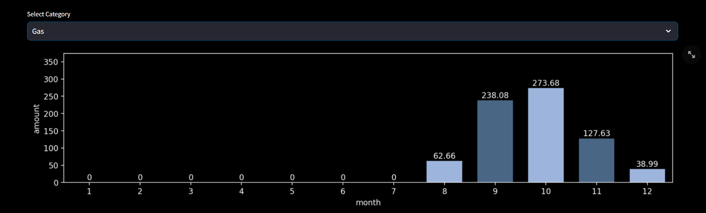

And my wife and I decided not to eat out during the month of november so I can see how much we spent.

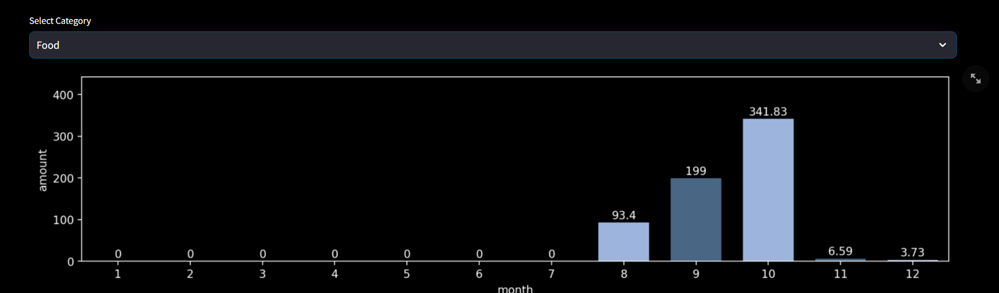

It looks like we did pretty good on our goal!

### 5. Can I make a budget to see where I am over and under spending?

I made a tool to make budgets for each category. This is what it looks like. This will show up on all the graphs as well whenever you save it.
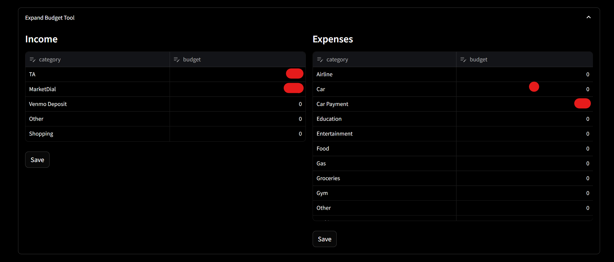

### If you want to use this tool

Because this is specific to my bank, this might not be useful to everyone. But if you use Bank of America, here is how you could use this tool!

Download your transactions from any of your accounts and upload them to the tool here

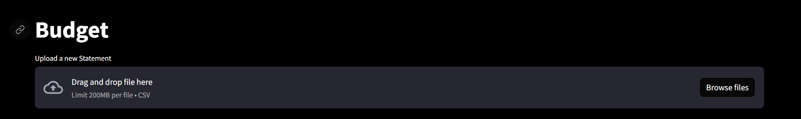

This can parse your transactions and make some cool and hopfully informative graphs

[back](../)
