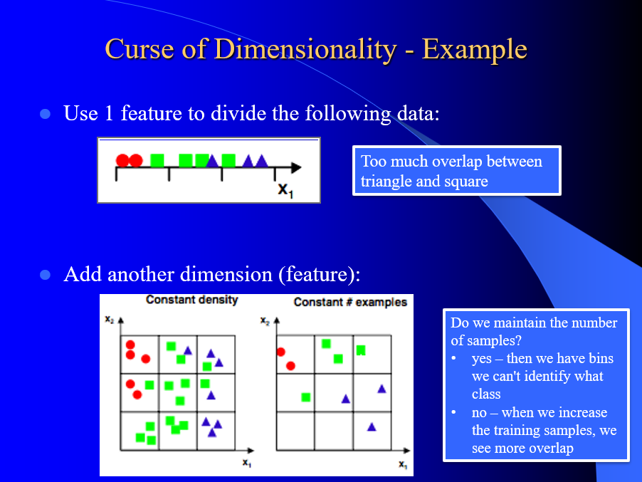

# Feature Selection Notes

**Curse of Dimentionality -** As the number of features or dimensions within a dataset increases, the amount of data needed to effectively generalize or make accurate predictions increases exponentially.



### Feature Selection

**Mostly Domain Knowledge**

Select the most relevent feautures

#### Filters

* create a model with each feature independent of the others
* select top p feautres ordered by 1 feature scores

#### Wrappers

* Can look at all combination of features to see which combination does best
* Forward Search
  * Start with empty feature set and run model
  * Add one feautre and run model
  * Continue until you stop getting improvements
* Backward Search
  * Start will all features
  * Remove one and check model performance
  * Continue until you stop getting improvements

### Feature Reduction

Combine/fuse feautres

### Principle Components Analysis

Can drop dimentions. Finding the main areas of variation. **Only for linear transformations**

1. Standardize data
2. Calculate covariance matrix
3. Calculate eigenvectors and eigenvalues of the covariance matrix

   * All eigenvectors are orthogonal to each other and form the new set of the dimenstions for the data
   * The magnitude of each eigenvalue corresponds to the variance along each new dimension
   * We can sort the principal components according to their eigenvalues
   * Just keep those dimensions with the largest eigenvalues

   $$
   \frac{\sum_{i=1}^{p} \lambda_i}{\sum_{i=1}^{n} \lambda_i}
   $$

   * That is the percent of variation that is explained in your new model
4. 1.Keep the p(< n) eigenvectors with the largest eigenvalues
5. Matrix multiply the p eigenvectors with the standardized TS to get a new TS with only p features

#### In Code - "Manual"

1. ```python
   from sklearn.preprocessing import StandardScaler
   scaler = StandardScaler()
   scaler.fit(X)
   scaled_data = scaler.transform(X)
   ```
2. ```python
   cov_matrix = np.cov(scaled_data.T)
   ```
3. ```python
   eigenvalues, eigenvectors = np.linalg.eig(cov_matrix)
   ```
4. ```python
   projection_matrix = (eigenvectors.T[:][:num_components]).T
   ```
5. ```python
   X_pca = scaled_data.dot(projection_matrix)
   ```

#### In Code - "Automatic"

```python
from sklearn.decomposition import PCA
from sklearn.preprocessing import StandardScaler
# We will start from the original data in X
# We need to scale the data
scaler = StandardScaler()
scaler.fit(X)
new_scaled_data = scaler.transform(X)
# Create a PCA object using a reduced number of components
pca = PCA(n_components=num_components)
pca.fit(new_scaled_data)
X_pca = pca.transform(new_scaled_data)
```

### Other Dimentionality Reduction Techniques

#### LDA (Linear Discriminant Analysis)

* projects data from a higher-dimensional space to a lower-dimensional space, but it aims to maximize the separation between classes while minimizing the variance within each class.

#### t-SNE (t-Distributed Stochastic Neighbor Embedding)

non-linear dimensionality reduction technique commonly used for visualizing high-dimensional data in a lower-dimensional space.works by minimizing the divergence between two probability distributions: a Gaussian distribution that represents pairwise similarities between data points in the high-dimensional space and a Student's t-distribution that represents pairwise similarities in the low-dimensional space.

#### UMAP (Uniform Manifold Approximation and Projection)

similar to t-SNE, but with better scalability and preservation of global structure.Generally faster than t-SNE
