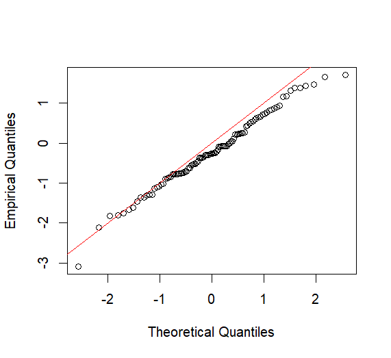
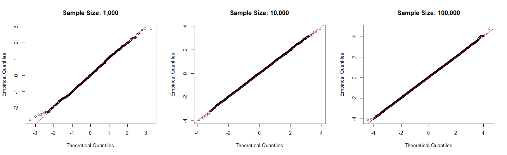

[Main Page](../../../)

[Projects](../../projects/projects-index.md)

# Statistical Parameters Estimators
You know the distribution that your data follows generally but need to estimate the parameters of that distribution. For example, you know your data is normal, but you need to estimate the population parameters based on your data.
## Graphical estimators for location scale families (QQ plot)
Quantile-Quantile (QQ) plots are used to compare the quantile functions of two distributions in order to see how alike the two distributions are. To do this we plot the theoretical quantiles on the x axis and the empirical quantiles on the y axis. The straighter the line is, the more alike the two distributions are. 

In R you can plot QQ plots using qqplot:

**For normal distributions**
```{r}
# your data
x <- rnorm(100)

# theoretical normal distribution   
theoretical_q <- qnorm(ppoints(length(x)))

qqplot(theoretical_q, x,
       xlab = "Theoretical Quantiles",
       ylab = "Empirical Quantiles")
abline(0, 1, col = "red")
```


As you can see, this line is not completely straight despite the fact that we know we are drawing from a normal distribution using ``` rnorm ```. This is because our sample size is only 100 and the 50th percentile of a standard normal distribution is 0, but the 50th percentile of our sample data is the median, which could be something other than 0. This is the case for every quantile. So our sample will never be exactly the same as the theoretical distribution. The bigger our sample gets however, the closer to the straight line it will be.



Now to use this to estimate parameters, it is important to note that this will only work with location scale distribution families. To do this, we plot our data against the standard version of the distribution we are estimating, fit a linear regression line to the plotted points and $\beta_0$ is approx. the location and $\beta_1$ is approx. the scale. 

As an example, we will use the Weibull distribution. "But wait!" you say, "weibull is not a location scale distribution!" And you are right. But, if we do a log transformation of the quantile function for the theoretical distribution and our data, it becomes a location scale distribution. Then we can transform our estimates back to the regular scale. Lets say that our data follows a weibull distribution with shape k = 1.5 and scale $\lambda$ = 2 (pretend like we don't know that for real we are trying to estimate that).

**Weibull Quantile Function**
$$
\lambda (-ln(1-p))^{1/k}
$$

**log transformation of Weibull Quantile Function**
$$
\overset{\mathrm{intercept}}{\log \lambda}
+
\overset{\mathrm{slope}}{\frac{1}{k}}
\log(-\log(1-p))
$$

**Standard Weibull Quantile on log scale**
$$
\begin{array}{l}
\text{shape } k = 1 \\
\text{scale } \lambda = 1 \\
\log(-\log(1-p))
\end{array}
$$

```{r}
# Weibull parameters
shape <- 1.5     # k
scale <- 2     # lambda

# Sample
x <- rweibull(1000, shape = shape, scale = scale)

p <- ppoints(length(x))           
theo <- log(-log(1 - p))
emp  <- log(sort(x))

plot(theo, emp,
     xlab = "log(-log(1 - p))",
     ylab = "log(x)",
     main = "Weibull QQ Plot (Log-Log)")
abline(lm(emp ~ theo), col = "red", lwd = 2)

# fit a linear regression line to the points
fit <- lm(emp ~ theo)
intercept <- coef(fit)[1]  # log(lambda)
slope     <- coef(fit)[2]  # 1/k

lambda_hat <- exp(intercept)
k_hat <- 1 / slope

> lambda_hat
(Intercept) 
   1.967974 
> k_hat
    theo 
1.416151 
```

From the above R code, we can see that our estimates for $\lambda$ and k are 1.97 and 1.42 respectively which is pretty close to our original parameters of 2 and 1.5.


## Maximum Likelihood Estimators (MLE)
Maximum likelihood estimators help you choose the most likely parameter values of your distribution given your data. Basically you assume a distribution then ask, what is the most plausible parameters for my data? Here are the steps.

1) Specify the distribution.
2) Write the likelihood function as the product of your variables across your distribution.
$$
L(\theta|x_1,... ,x_n) = \prod_{i=1}^{n} f(x_i|\theta)
$$
3) Take the log of the likelihood to get the log-likelihood.
$$
\ell(\theta) = logL(\theta)
$$
4) Take partial derivatives of the log-likelihood with respect to the parameters you are estimating.
$$
\frac{\partial \ell(\theta)}{\partial \theta} 
$$
5) Set partial derivative to 0 and solve for the parameter. This gives the MLE.
$$
\frac{\partial \ell(\theta)}{\partial \theta} =0
$$
6) Check and see if that is actually the maximum. Take the second derivative to make sure that isn't a local maximum.

**Example with the exponential distribution**

$$ \text{Step 1: } f(X) = \lambda e^{-\lambda x} $$

$$
\text{Step 2: } L(\lambda) = f(\lambda \mid x_1,\dots,x_n)
= \prod_{i=1}^{n} \lambda e^{-\lambda x_i} = \lambda^n \exp\!\Big(-\lambda \sum_{i=1}^{n} x_i\Big)
$$

$$ \text{Step 3: } \ell(\lambda) = n \log(\lambda) - \lambda \sum x_i $$

$$ \text{Step 4: } \frac{\partial \ell(\lambda)}{\partial \lambda} = \frac{n}{\lambda} - \sum x_i $$

$$ \text{Step 5: } \frac{n}{\lambda} - \sum x_i = 0, \quad \hat{\lambda} = \frac{n}{\sum x_i} $$

[Main Page](../../../)

[Projects](../../projects/projects-index.md)