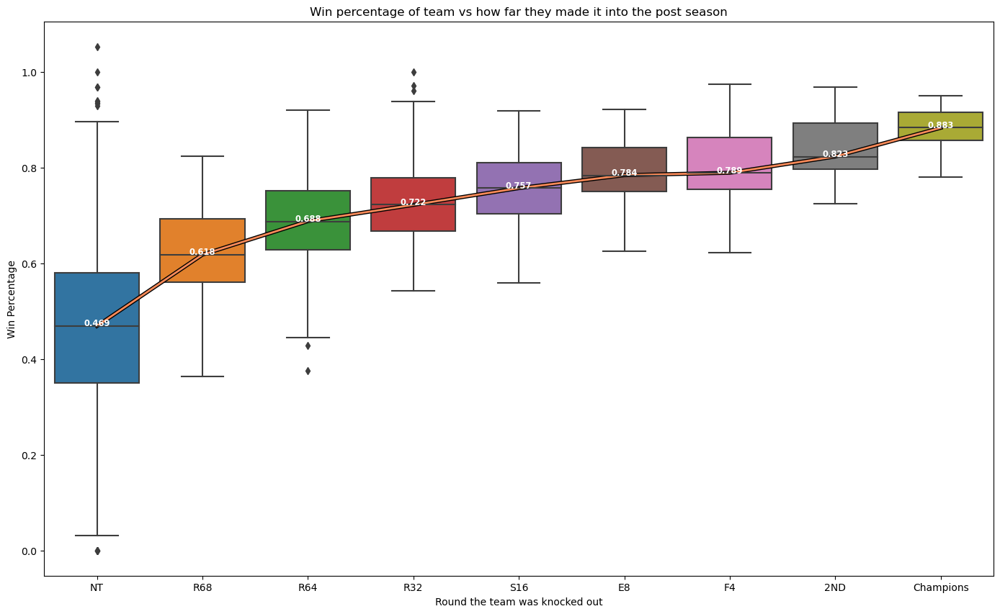

Here is the [data](https://www.kaggle.com/datasets/garrettspringer/ncaa-basketball) I used. I scraped it from [this website](https://barttorvik.com/#)

```python
import numpy as np # linear algebra
import pandas as pd # data processing, CSV file I/O (e.g. pd.read_csv)
from matplotlib import pyplot as plt
import seaborn as sns
from sklearn.metrics import mean_squared_error
from sklearn.ensemble import RandomForestClassifier, RandomForestRegressor
import statsmodels.api as sm
from sklearn.linear_model import LinearRegression
from sklearn.model_selection import train_test_split
import warnings
warnings.filterwarnings('ignore')
```

```python
df = pd.read_csv("ncaab.csv")
df['WP'] = df['W']/df['G']
df.head()
```

<table border="1" class="dataframe">
  <thead>
    <tr style="text-align: right;">
      <th></th>
      <th>SEED</th>
      <th>TEAM</th>
      <th>CONF</th>
      <th>G</th>
      <th>W</th>
      <th>ADJOE</th>
      <th>ADJDE</th>
      <th>BARTHAG</th>
      <th>EFG_O</th>
      <th>EFG_D</th>
      <th>...</th>
      <th>FTRD</th>
      <th>2P_O</th>
      <th>2P_D</th>
      <th>3P_O</th>
      <th>3P_D</th>
      <th>ADJ_T</th>
      <th>WAB</th>
      <th>POSTSEASON</th>
      <th>YEAR</th>
      <th>WP</th>
    </tr>
  </thead>
  <tbody>
    <tr>
      <th>0</th>
      <td>1.0</td>
      <td>Kansas</td>
      <td>B12</td>
      <td>39</td>
      <td>37</td>
      <td>121.0</td>
      <td>85.5</td>
      <td>0.982</td>
      <td>56.6</td>
      <td>44.3</td>
      <td>...</td>
      <td>31.0</td>
      <td>55.4</td>
      <td>41.2</td>
      <td>39.7</td>
      <td>32.8</td>
      <td>68.6</td>
      <td>9.93</td>
      <td>Champions</td>
      <td>2008</td>
      <td>0.948718</td>
    </tr>
    <tr>
      <th>1</th>
      <td>1.0</td>
      <td>Memphis</td>
      <td>CUSA</td>
      <td>40</td>
      <td>38</td>
      <td>117.0</td>
      <td>86.1</td>
      <td>0.971</td>
      <td>52.7</td>
      <td>43.4</td>
      <td>...</td>
      <td>31.7</td>
      <td>52.9</td>
      <td>42.6</td>
      <td>34.9</td>
      <td>30.2</td>
      <td>70.2</td>
      <td>8.95</td>
      <td>2ND</td>
      <td>2008</td>
      <td>0.950000</td>
    </tr>
    <tr>
      <th>2</th>
      <td>1.0</td>
      <td>UCLA</td>
      <td>P10</td>
      <td>38</td>
      <td>35</td>
      <td>116.0</td>
      <td>86.8</td>
      <td>0.966</td>
      <td>52.2</td>
      <td>46.5</td>
      <td>...</td>
      <td>25.6</td>
      <td>52.4</td>
      <td>45.4</td>
      <td>34.4</td>
      <td>32.9</td>
      <td>66.1</td>
      <td>10.80</td>
      <td>F4</td>
      <td>2008</td>
      <td>0.921053</td>
    </tr>
    <tr>
      <th>3</th>
      <td>1.0</td>
      <td>North Carolina</td>
      <td>ACC</td>
      <td>39</td>
      <td>36</td>
      <td>122.0</td>
      <td>91.9</td>
      <td>0.965</td>
      <td>53.0</td>
      <td>48.2</td>
      <td>...</td>
      <td>25.7</td>
      <td>52.1</td>
      <td>47.8</td>
      <td>37.2</td>
      <td>32.6</td>
      <td>74.7</td>
      <td>11.90</td>
      <td>F4</td>
      <td>2008</td>
      <td>0.923077</td>
    </tr>
    <tr>
      <th>4</th>
      <td>3.0</td>
      <td>Wisconsin</td>
      <td>B10</td>
      <td>36</td>
      <td>31</td>
      <td>112.0</td>
      <td>85.4</td>
      <td>0.960</td>
      <td>50.6</td>
      <td>43.4</td>
      <td>...</td>
      <td>25.4</td>
      <td>49.3</td>
      <td>41.7</td>
      <td>35.6</td>
      <td>31.3</td>
      <td>63.1</td>
      <td>8.38</td>
      <td>S16</td>
      <td>2008</td>
      <td>0.861111</td>
    </tr>
  </tbody>
</table>
<p>5 rows � 25 columns</p>
</div>

# Can you predict how far a team will go in the postseason based on their regular season?

# EDA

Lets find the percentage of number 1 seeded teams that end up winning the tournament

```python
seed = 1

print('Teams that were seeded number', seed,'going into the postseason that ended up winning the NCAA championship')
champs = df.loc[(df['SEED'] == seed) & (df['POSTSEASON'] == 'Champions')][['TEAM', 'YEAR']].sort_values(by='YEAR')
display(champs)

print('Percent of teams that were ranked number', seed,'that won the championship is', round(champs["TEAM"].count()/df.loc[(df['SEED'] == seed)]['TEAM'].count(), 3)*100, '%')

final = df.loc[(df['SEED'] == seed) & ((df['POSTSEASON'] == 'Champions') | (df['POSTSEASON'] == '2ND'))][['TEAM', 'YEAR', 'POSTSEASON']].sort_values(by='YEAR')
print('Percent of teams that were ranked number', seed ,'that made it to the final is', round(final["TEAM"].count()/df.loc[(df['SEED'] == seed)]['TEAM'].count(), 1)*100, '%')

final4 = df.loc[(df['SEED'] == seed) & ((df['POSTSEASON'] == 'Champions') | (df['POSTSEASON'] == '2ND') | (df['POSTSEASON'] == 'F4'))][['TEAM', 'YEAR', 'POSTSEASON']].sort_values(by='YEAR')
print('Percent of teams that were ranked number', seed, 'that made it to the final 4 is', round(final4["TEAM"].count()/df.loc[(df['SEED'] == seed)]['TEAM'].count(), 2)*100, '%')
```

    Teams that were seeded number 1 going into the postseason that ended up winning the NCAA championship

<table border="1" class="dataframe">
  <thead>
    <tr style="text-align: right;">
      <th></th>
      <th>TEAM</th>
      <th>YEAR</th>
    </tr>
  </thead>
  <tbody>
    <tr>
      <th>0</th>
      <td>Kansas</td>
      <td>2008</td>
    </tr>
    <tr>
      <th>342</th>
      <td>North Carolina</td>
      <td>2009</td>
    </tr>
    <tr>
      <th>684</th>
      <td>Duke</td>
      <td>2010</td>
    </tr>
    <tr>
      <th>1374</th>
      <td>Kentucky</td>
      <td>2012</td>
    </tr>
    <tr>
      <th>1718</th>
      <td>Louisville</td>
      <td>2013</td>
    </tr>
    <tr>
      <th>2415</th>
      <td>Duke</td>
      <td>2015</td>
    </tr>
    <tr>
      <th>3115</th>
      <td>North Carolina</td>
      <td>2017</td>
    </tr>
    <tr>
      <th>3464</th>
      <td>Villanova</td>
      <td>2018</td>
    </tr>
    <tr>
      <th>3815</th>
      <td>Virginia</td>
      <td>2019</td>
    </tr>
    <tr>
      <th>4519</th>
      <td>Baylor</td>
      <td>2021</td>
    </tr>
    <tr>
      <th>4866</th>
      <td>Kansas</td>
      <td>2022</td>
    </tr>
  </tbody>
</table>
</div>

    Percent of teams that were ranked number 1 that won the championship is 19.6 %
    Percent of teams that were ranked number 1 that made it to the final is 30.0 %
    Percent of teams that were ranked number 1 that made it to the final 4 is 39.0 %

```python
seed = 2

print('Teams that were seeded number', seed,'going into the postseason that ended up winning the NCAA championship')
champs = df.loc[(df['SEED'] == seed) & (df['POSTSEASON'] == 'Champions')][['TEAM', 'YEAR']].sort_values(by='YEAR')
display(champs)

print('Percent of teams that were ranked number', seed,'that won the championship is', round(champs["TEAM"].count()/df.loc[(df['SEED'] == seed)]['TEAM'].count(), 3)*100, '%')

final = df.loc[(df['SEED'] == seed) & ((df['POSTSEASON'] == 'Champions') | (df['POSTSEASON'] == '2ND'))][['TEAM', 'YEAR', 'POSTSEASON']].sort_values(by='YEAR')
print('Percent of teams that were ranked number', seed ,'that made it to the final is', round(final["TEAM"].count()/df.loc[(df['SEED'] == seed)]['TEAM'].count(), 3)*100, '%')

final4 = df.loc[(df['SEED'] == seed) & ((df['POSTSEASON'] == 'Champions') | (df['POSTSEASON'] == '2ND') | (df['POSTSEASON'] == 'F4'))][['TEAM', 'YEAR', 'POSTSEASON']].sort_values(by='YEAR')
print('Percent of teams that were ranked number', seed, 'that made it to the final 4 is', round(final4["TEAM"].count()/df.loc[(df['SEED'] == seed)]['TEAM'].count(), 3)*100, '%')
```

    Teams that were seeded number 2 going into the postseason that ended up winning the NCAA championship

<div>
<style scoped>
    .dataframe tbody tr th:only-of-type {
        vertical-align: middle;
    }

<table border="1" class="dataframe">
  <thead>
    <tr style="text-align: right;">
      <th></th>
      <th>TEAM</th>
      <th>YEAR</th>
    </tr>
  </thead>
  <tbody>
    <tr>
      <th>2764</th>
      <td>Villanova</td>
      <td>2016</td>
    </tr>
  </tbody>
</table>
</div>

    Percent of teams that were ranked number 2 that won the championship is 1.7999999999999998 %
    Percent of teams that were ranked number 2 that made it to the final is 5.4 %
    Percent of teams that were ranked number 2 that made it to the final 4 is 19.6 %

```python
seed = 3

print('Teams that were seeded number', seed,'going into the postseason that ended up winning the NCAA championship')
champs = df.loc[(df['SEED'] == seed) & (df['POSTSEASON'] == 'Champions')][['TEAM', 'YEAR']].sort_values(by='YEAR')
display(champs)

print('Percent of teams that were ranked number', seed,'that won the championship is', round(champs["TEAM"].count()/df.loc[(df['SEED'] == seed)]['TEAM'].count(), 3)*100, '%')

final = df.loc[(df['SEED'] == seed) & ((df['POSTSEASON'] == 'Champions') | (df['POSTSEASON'] == '2ND'))][['TEAM', 'YEAR', 'POSTSEASON']].sort_values(by='YEAR')
print('Percent of teams that were ranked number', seed ,'that made it to the final is', round(final["TEAM"].count()/df.loc[(df['SEED'] == seed)]['TEAM'].count(), 3)*100, '%')

final4 = df.loc[(df['SEED'] == seed) & ((df['POSTSEASON'] == 'Champions') | (df['POSTSEASON'] == '2ND') | (df['POSTSEASON'] == 'F4'))][['TEAM', 'YEAR', 'POSTSEASON']].sort_values(by='YEAR')
print('Percent of teams that were ranked number', seed, 'that made it to the final 4 is', round(final4["TEAM"].count()/df.loc[(df['SEED'] == seed)]['TEAM'].count(), 3)*100, '%')
```

    Teams that were seeded number 3 going into the postseason that ended up winning the NCAA championship

<div>
<style scoped>
    .dataframe tbody tr th:only-of-type {
        vertical-align: middle;
    }

<table border="1" class="dataframe">
  <thead>
    <tr style="text-align: right;">
      <th></th>
      <th>TEAM</th>
      <th>YEAR</th>
    </tr>
  </thead>
  <tbody>
    <tr>
      <th>1042</th>
      <td>Connecticut</td>
      <td>2011</td>
    </tr>
  </tbody>
</table>
</div>

    Percent of teams that were ranked number 3 that won the championship is 1.7999999999999998 %
    Percent of teams that were ranked number 3 that made it to the final is 5.4 %
    Percent of teams that were ranked number 3 that made it to the final 4 is 8.9 %

```python
seed = 4

print('Teams that were seeded number', seed,'going into the postseason that ended up winning the NCAA championship')
champs = df.loc[(df['SEED'] == seed) & (df['POSTSEASON'] == 'Champions')][['TEAM', 'YEAR']].sort_values(by='YEAR')
display(champs)

print('Percent of teams that were ranked number', seed,'that won the championship is', round(champs["TEAM"].count()/df.loc[(df['SEED'] == seed)]['TEAM'].count(), 3)*100, '%')

final = df.loc[(df['SEED'] == seed) & ((df['POSTSEASON'] == 'Champions') | (df['POSTSEASON'] == '2ND'))][['TEAM', 'YEAR', 'POSTSEASON']].sort_values(by='YEAR')
print('Percent of teams that were ranked number', seed ,'that made it to the final is', round(final["TEAM"].count()/df.loc[(df['SEED'] == seed)]['TEAM'].count(), 3)*100, '%')

final4 = df.loc[(df['SEED'] == seed) & ((df['POSTSEASON'] == 'Champions') | (df['POSTSEASON'] == '2ND') | (df['POSTSEASON'] == 'F4'))][['TEAM', 'YEAR', 'POSTSEASON']].sort_values(by='YEAR')
print('Percent of teams that were ranked number', seed, 'that made it to the final 4 is', round(final4["TEAM"].count()/df.loc[(df['SEED'] == seed)]['TEAM'].count(), 3)*100, '%')
```

    Teams that were seeded number 4 going into the postseason that ended up winning the NCAA championship

<div>
<style scoped>
    .dataframe tbody tr th:only-of-type {
        vertical-align: middle;
    }

<table border="1" class="dataframe">
  <thead>
    <tr style="text-align: right;">
      <th></th>
      <th>TEAM</th>
      <th>YEAR</th>
    </tr>
  </thead>
  <tbody>
  </tbody>
</table>
</div>

    Percent of teams that were ranked number 4 that won the championship is 0.0 %
    Percent of teams that were ranked number 4 that made it to the final is 1.7999999999999998 %
    Percent of teams that were ranked number 4 that made it to the final 4 is 7.1 %

```python
df['POSTSEASON'] = df['POSTSEASON'].fillna('NT') #'NT' means not in the tournament
df['SEED'] = df['SEED'].fillna('None')
```

Lets look at win percentage in the season and see how it effects the postseason performance

```python
df['WP'] = df['W']/df['G']
df[['WP','POSTSEASON']].groupby('POSTSEASON').mean().sort_values(by = 'WP', ascending = False)
```

<div>
<style scoped>
    .dataframe tbody tr th:only-of-type {
        vertical-align: middle;
    }

<table border="1" class="dataframe">
  <thead>
    <tr style="text-align: right;">
      <th></th>
      <th>WP</th>
    </tr>
    <tr>
      <th>POSTSEASON</th>
      <th></th>
    </tr>
  </thead>
  <tbody>
    <tr>
      <th>Champions</th>
      <td>0.881720</td>
    </tr>
    <tr>
      <th>2ND</th>
      <td>0.837555</td>
    </tr>
    <tr>
      <th>F4</th>
      <td>0.800714</td>
    </tr>
    <tr>
      <th>E8</th>
      <td>0.790041</td>
    </tr>
    <tr>
      <th>S16</th>
      <td>0.756275</td>
    </tr>
    <tr>
      <th>R32</th>
      <td>0.729144</td>
    </tr>
    <tr>
      <th>R64</th>
      <td>0.693218</td>
    </tr>
    <tr>
      <th>R68</th>
      <td>0.619213</td>
    </tr>
    <tr>
      <th>NT</th>
      <td>0.463854</td>
    </tr>
  </tbody>
</table>
</div>

```python
plt.figure(figsize = (17,10))
box_plot = sns.boxplot(x = df['POSTSEASON'], y = df['WP'], order = ['NT', 'R68', 'R64', 'R32', 'S16','E8', 'F4', '2ND', 'Champions'])
plt.ylabel('Win Percentage')
plt.xlabel('Round the team was knocked out')
plt.title('Win percentage of team vs how far they made it into the post season')
medians = round(df[['WP','POSTSEASON']].groupby('POSTSEASON').median().sort_values(by = 'WP', ascending = True)['WP'],3)
vertical_offset = df['WP'].median() * 0.05 # offset from median for display

for xtick in box_plot.get_xticks():
    box_plot.text(xtick,medians[xtick],medians[xtick], 
            horizontalalignment='center',size='small',color='w',weight='semibold')

medians = round(df[['WP','POSTSEASON']].groupby('POSTSEASON').median().sort_values(by = 'WP', ascending = True),3)
sns.lineplot(x = medians.index, y = medians['WP'], color = '#000000', linewidth = 4)
sns.lineplot(x = medians.index, y = medians['WP'], color = '#f98a59', linewidth = 2)
plt.show()
```



We can see that on average a team with a higher winning percentage during the season will go farther in the tournament and the spread also decreases as the tournament goes on. The round of 68 is a little weird because those are play in games so teams with a higher winning percentage will not get represented. Lets see now the lowest seed in each round and the highest seed that got knocked out each round

```python
display(df[['SEED', 'POSTSEASON']].groupby('POSTSEASON').max().reindex(['R64', 'R32', 'S16', 'E8', 'F4', '2ND','Champions']))
display(df[['SEED', 'POSTSEASON']].groupby(['POSTSEASON']).min().reindex(['R64', 'R32', 'S16', 'E8', 'F4', '2ND','Champions']))
```

<div>
<style scoped>
    .dataframe tbody tr th:only-of-type {
        vertical-align: middle;
    }

<table border="1" class="dataframe">
  <thead>
    <tr style="text-align: right;">
      <th></th>
      <th>SEED</th>
    </tr>
    <tr>
      <th>POSTSEASON</th>
      <th></th>
    </tr>
  </thead>
  <tbody>
    <tr>
      <th>R64</th>
      <td>16.0</td>
    </tr>
    <tr>
      <th>R32</th>
      <td>16.0</td>
    </tr>
    <tr>
      <th>S16</th>
      <td>15.0</td>
    </tr>
    <tr>
      <th>E8</th>
      <td>15.0</td>
    </tr>
    <tr>
      <th>F4</th>
      <td>11.0</td>
    </tr>
    <tr>
      <th>2ND</th>
      <td>8.0</td>
    </tr>
    <tr>
      <th>Champions</th>
      <td>7.0</td>
    </tr>
  </tbody>
</table>
</div>

<div>
<style scoped>
    .dataframe tbody tr th:only-of-type {
        vertical-align: middle;
    }

<table border="1" class="dataframe">
  <thead>
    <tr style="text-align: right;">
      <th></th>
      <th>SEED</th>
    </tr>
    <tr>
      <th>POSTSEASON</th>
      <th></th>
    </tr>
  </thead>
  <tbody>
    <tr>
      <th>R64</th>
      <td>1.0</td>
    </tr>
    <tr>
      <th>R32</th>
      <td>1.0</td>
    </tr>
    <tr>
      <th>S16</th>
      <td>1.0</td>
    </tr>
    <tr>
      <th>E8</th>
      <td>1.0</td>
    </tr>
    <tr>
      <th>F4</th>
      <td>1.0</td>
    </tr>
    <tr>
      <th>2ND</th>
      <td>1.0</td>
    </tr>
    <tr>
      <th>Champions</th>
      <td>1.0</td>
    </tr>
  </tbody>
</table>
</div>

Interesting. So in the last 10 or so years in every round there has been at least 1 team seeded first that has been eliminated.

```python
df_wo_NTteams = df.loc[(df['POSTSEASON'] != 'NT') & (df['POSTSEASON'] != 'R68')]
avg_seed = df_wo_NTteams[['SEED', 'POSTSEASON']].groupby('POSTSEASON').mean().reindex(['R64', 'R32', 'S16', 'E8', 'F4', '2ND','Champions'])

fig, [ax, ax2] = plt.subplots(1, 2, figsize=(20, 8))
sns.barplot(x = avg_seed.index, y = avg_seed['SEED'], ax = ax)
ax.set_xlabel('Round team got knocked out')
ax.set_ylabel('Average seed of team')
ax.set_title('Avereage seed of teams and when they got eliminated from the tournament')

sns.boxplot(y = df_wo_NTteams['SEED'], x = df_wo_NTteams['POSTSEASON'], ax = ax2, order = ['R64', 'R32', 'S16','E8', 'F4', '2ND', 'Champions'])
ax2.set_xlabel('Round team got knocked out')
ax2.set_ylabel('Seed of team')
ax2.set_title('Avereage seed of teams and when they got eliminated from the tournament')
plt.show()
```


From these graphs vs the one above for win percentage, win percentage looks like a better estimator for how far they make it in the tournament. It is also interesting that in the final 4 there is a bigger spread than the elite 8

# Which conference produces the most champions?

```python
d = pd.DataFrame(df[['CONF', 'POSTSEASON']].loc[(df['POSTSEASON'] == 'Champions') | (df['POSTSEASON'] == '2ND') | (df['POSTSEASON'] == 'F4') | (df['POSTSEASON'] == 'E8')].value_counts()).reset_index()
fig, ax = plt.subplots(figsize = (10,7))
sns.barplot(x='POSTSEASON', y=0, hue='CONF', data=d, order=['E8', 'F4', '2ND', 'Champions'])
ax.set_ylabel('Number of teams')
ax.set_xlabel('Postseason')
ax.set_title('Which conference produces the most champions?')
plt.show()
```


#### The only conference that has had teams that have been knocked out in each of the rounds at and after elite 8 is the ACC. The champions have come from only the ACC, BE, and Amer conferences, with Amer only being represented once

# Upsets

#### One of the biggest questions in the tournament is when and who will be involved in an upset. In the first round of 64, there are 32 games which means there is a possible 32 upsets. The greater the spread in seed, the more shocking it is when there is an upset.

We will look at seeds 1-8 who lost in the 1st round (upset)

```python
temp_df = df[df.SEED != 'None']
temp_df['SEED'] = temp_df['SEED'].astype('int')
temp_df = temp_df.loc[(temp_df['POSTSEASON'] == 'R64') & (temp_df['SEED'] <= 8)]
seed_upset_df = pd.DataFrame(temp_df['SEED'].value_counts()).reset_index().rename(columns = {'index' : 'SEED', 'SEED': 'Count'}).sort_values(by = 'SEED', ascending = True)
fig, ax = plt.subplots(figsize = (8, 5))
sns.barplot(x = seed_upset_df['SEED'], y = seed_upset_df['Count'], ax = ax)
ax.set_title('Seed and how many times they have been upset in the first round of the tournament')
plt.show()
```


# Lets model a tournament and see how it does

### 2016 had a lot of upsets


#### The March Madness tournament is basically 4 single elimination tournaments put into one, with the winners of each going into another single elimination tournament (semis). So we will model one single elimination tournament and use it for all 4 for the 2016 tournament

```python
df = pd.read_csv('ncaab2.csv')
df = pd.get_dummies(df, columns = ["CONF"])
df['SEED'] = df['SEED'].fillna('None')
df['POSTSEASON'] = df['POSTSEASON'].fillna('NT')
df['WP'] = df['W']/df['G']
index_NT = df[df['POSTSEASON'] == 'NT'].index
df.drop(index_NT, inplace = True)
df["SEED"].replace({'None':19}, inplace = True)
df['POSTSEASON'].replace({'Champions' : 1, '2ND':2, 'F4':3, 'E8':4, 'S16':5, 'R32':6, 'R64':7, 'R68':8, 'NT':9}, inplace = True)
```

```python
dftest = pd.read_csv('ncaab.csv')
dftest = pd.get_dummies(dftest, columns = ["CONF"])
dftest['SEED'] = dftest['SEED'].fillna('None')
dftest['POSTSEASON'] = dftest['POSTSEASON'].fillna('NT')
dftest['WP'] = dftest['W']/df['G']
index_NT = dftest[dftest['POSTSEASON'] == 'NT'].index
dftest.drop(index_NT, inplace = True)
dftest["SEED"].replace({'None':19}, inplace = True)
dftest['POSTSEASON'].replace({'Champions' : 1, '2ND':2, 'F4':3, 'E8':4, 'S16':5, 'R32':6, 'R64':7, 'R68':8, 'NT':9}, inplace = True)


X = dftest.drop(["POSTSEASON", "YEAR", "TEAM",], axis = 1)
y = dftest["POSTSEASON"]

X_train, X_test, y_train, y_test = train_test_split(X, y)
```

I will test a couple of models here to see which one does the best

```python
models = [RandomForestClassifier(), RandomForestRegressor(), LinearRegression()]
for i in range(len(models)):
    model_i = models[i]
    model_i.fit(X_train, y_train)
    Y_pred_i = model_i.predict(X_test)
    print("Y_pred_", i, "score = ", model_i.score(X_test, y_test))
    print(1 - (1-model_i.score(X, y))*(len(y)-1)/(len(y)-X.shape[1]-1))
```

    Y_pred_ 0 score =  0.5296610169491526
    0.8747092762010893
    Y_pred_ 1 score =  0.6616542177139173
    0.8814344967983481
    Y_pred_ 2 score =  0.5483815965024391
    0.5917293933833976

RandomForestRegressor performed the best. Even though technically the round the team was knocked out in is discrete we will look at is as continuous so it produces better estimates

```python
model = RandomForestRegressor()
model.fit(X_train, y_train)
Y_pred = model.predict(X_test)
print("score = ", model.score(X_test, y_test))
```

    score =  0.6625456879709741

```python
importances = model.feature_importances_
features = pd.DataFrame({'feature': X_train.columns, 'importance': importances})

# Sort the DataFrame based on the feature importances
features = features.sort_values(by='importance', ascending=False)

features.to_csv('feature_importance_revenue.csv')

# Print the top 10 features and their importances
print("Top 10 features:")
for i, row in features[:10].iterrows():
    print("- Feature", row['feature'], ":", row['importance'])
```

    Top 10 features:
    - Feature G : 0.6172673848752628
    - Feature BARTHAG : 0.13560521169952441
    - Feature WAB : 0.022598640229562636
    - Feature 3P_D : 0.017359859773431553
    - Feature FTRD : 0.014589488053497454
    - Feature WP : 0.014444998044008181
    - Feature ADJDE : 0.013891105285447599
    - Feature FTR : 0.01314076766448173
    - Feature 2P_D : 0.012103701756581937
    - Feature ADJ_T : 0.011986024431650404

```python
def quarter_tournament(year, team_list):
    X = df[df['YEAR'] == year].drop(["POSTSEASON", "YEAR", "TEAM"], axis = 1)
    Y_pred = model.predict(X)
  
  
    df16 = df[df['YEAR'] == year]
    df16['pred'] = Y_pred
    df16.dropna(subset = ['POSTSEASON'], inplace = True)
    team_df = df16[df16['POSTSEASON'] != 'R68'].reset_index(drop = True)
    df16['PredPostSeason'] = np.nan
  
    teams_df = pd.DataFrame(columns = team_df.columns)

    for team in team_list:
        teams_df = teams_df.append(team_df.loc[team_df['TEAM']==team])
  
    teams = teams_df
  
  
    #round of 32 is the next round
    r32 = pd.DataFrame(columns = teams.columns)
    s16 = pd.DataFrame(columns = teams.columns)
    e8 = pd.DataFrame(columns = teams.columns)

    #final four is the champ of each individual division
    f4 = pd.DataFrame(columns = teams.columns)
  


    print("ROUND OF 64")
    # round of 64
    #for each team in the bracket (seed 1 - 16)
    for i in range(1, 9):
        team1 = teams.loc[teams['SEED'] == i][['TEAM']].iloc[0,0]
        team2 = teams.loc[teams['SEED'] == 17-i][['TEAM']].iloc[0,0]
        print(team1, 'vs', team2)


        WP1 = teams.loc[teams['SEED'] == i][['pred']].iloc[0,0]
        WP2 = teams.loc[teams['SEED'] == 17-i][['pred']].iloc[0,0]
        if(WP1 < WP2):
            winner = team1
            loser = team2
        else:
            winner = team2
            loser = team1

        #df16.loc[df16['TEAM'] == loser, 'PredPostSeason'] = 'R64'
        print("Winner:", winner)
        r32 = r32.append(teams.loc[teams['TEAM'] == winner])


    print("\nROUND OF 32")
    # round of 32

    #for the teams in the tournament still
    for i in range(1,5):
        team = r32.loc[(r32['SEED'] == i) | \
                       (r32['SEED'] == 17 - i)]

        team2 = r32.loc[(r32['SEED'] == 9 - i) | \
                      (r32['SEED'] == 8 + i)]

        winner = ' '

        #if the te
        if not team.empty:
            matchup = team.append(team2)
        if team.empty:
            matchup = matchup.append(team2)

        if len(matchup) == 2:
            print(matchup.iloc[0,]['TEAM'], 'vs', matchup.iloc[1,]['TEAM'])

            WP1 = matchup.iloc[0,]['pred']
            WP2 = matchup.iloc[1,]['pred']

            if(WP1 < WP2):
                winner = matchup.iloc[0,]['TEAM']
            else:
                winner = matchup.iloc[1,]['TEAM']

            matchup = pd.DataFrame(columns = teams.columns)

        print("Winner:", winner)
        s16 = s16.append(teams.loc[teams['TEAM'] == winner])


    print("\nELITE 8")
    # elite 8


    team = s16.loc[((s16['SEED'] == 1) | (s16['SEED'] == 16)) | \
                      ((s16['SEED'] == 8) | (s16['SEED'] == 9))]
    team2 = s16.loc[((s16['SEED'] == 5) | (s16['SEED'] == 12)) | \
                      ((s16['SEED'] == 4) | (s16['SEED'] == 13))]

    team3 = s16.loc[((s16['SEED'] == 6) | (s16['SEED'] == 11)) | \
                      ((s16['SEED'] == 3) | (s16['SEED'] == 14))]

    team4 = s16.loc[((s16['SEED'] == 7) | (s16['SEED'] == 10)) | \
                    ((s16['SEED'] == 2) | (s16['SEED'] == 15))]


    winner = ' '

    ts = [team, team2, team3, team4]

    for team in ts:
        matchup = matchup.append(team)

        if(len(matchup) == 2):
            print(matchup.iloc[0,]['TEAM'], 'vs', matchup.iloc[1,]['TEAM'])

            WP1 = matchup.iloc[0,]['pred']
            WP2 = matchup.iloc[1,]['pred']

            if(WP1 < WP2):
                winner = matchup.iloc[0,]['TEAM']
            else:
                winner = matchup.iloc[1,]['TEAM']

            matchup = pd.DataFrame(columns = teams.columns)
            print("Winner:", winner)
            e8 = e8.append(teams.loc[teams['TEAM'] == winner])


    team = e8.loc[(e8['SEED'] == 1) | (e8['SEED'] == 16) |\
                 (e8['SEED'] == 8) | (e8['SEED'] == 9) |\
                 (e8['SEED'] == 5) | (e8['SEED'] == 12)|\
                 (e8['SEED'] == 4) | (e8['SEED'] == 13)]
    team2 = e8.loc[(e8['SEED'] == 6) | (e8['SEED'] == 11) |\
                 (e8['SEED'] == 3) | (e8['SEED'] == 14) |\
                 (e8['SEED'] == 7) | (e8['SEED'] == 10)|\
                 (e8['SEED'] == 2) | (e8['SEED'] == 15)]


    WP1 = team.iloc[0,]['pred']
    WP2 = team2.iloc[0,]['pred']


    if(WP1 < WP2):
        winner = team.iloc[0,]['TEAM']
    else:
        winner = team2.iloc[0,]['TEAM']


    f4 = f4.append(teams.loc[teams['TEAM'] == winner])
    return f4
```

```python
def tournament(year, south, west, east, midwest):
    f4_south = quarter_tournament(year, south)
    f4_west = quarter_tournament(year, west)
    f4_east = quarter_tournament(year, east)
    f4_midwest = quarter_tournament(year, midwest)
  
    f4 = pd.concat([f4_south, f4_west, f4_east, f4_midwest], axis = 0)
  
    matchup1 = pd.concat([f4_midwest, f4_west], axis = 0)
    matchup2 = pd.concat([f4_south, f4_east], axis = 0)
  
    print("\nFINAL 4")
  
    print(matchup1.iloc[0]['TEAM'], 'vs', matchup1.iloc[1]['TEAM'])
    WP1 = matchup1.iloc[0,]['pred']
    WP2 = matchup1.iloc[1,]['pred']
  
    if(WP1 < WP2):
        winner1 = matchup1.iloc[0,]['TEAM']
    else:
        winner1 = matchup1.iloc[1,]['TEAM']
  
    print("Winner: ", winner1)
  
  
  
    print(matchup2.iloc[0]['TEAM'], 'vs', matchup2.iloc[1]['TEAM'])
    WP1 = matchup2.iloc[0,]['pred']
    WP2 = matchup2.iloc[1,]['pred']
  
    if(WP1 < WP2):
        winner2 = matchup2.iloc[0,]['TEAM']
    else:
        winner2 = matchup2.iloc[1,]['TEAM']
  
    print("Winner: ", winner2)
  
    champ = pd.DataFrame(columns = f4.columns)
  
    champ = pd.concat([f4.loc[f4['TEAM'] == winner1], f4.loc[f4['TEAM'] == winner2]])
  
    WP1 = champ.iloc[0,]['pred']
    WP2 = champ.iloc[0,]['pred']
  
    if(WP1 < WP2):
        winner = champ.iloc[0,]['TEAM']
    else:
        winner = champ.iloc[1,]['TEAM']
  
  
    print('\nCHAMPIONSHIP')
    print(champ.iloc[0,]["TEAM"], ' vs ',champ.iloc[1,]["TEAM"])
  
    print("Champion: ", winner)

```

```python
team_list_south = ['Alabama', 'Texas A&M Corpus Chris', 'Maryland', 'West Virginia', 'San Diego St.',\
                  'College of Charleston', 'Virginia', 'Furman', 'Creighton', 'North Carolina St.', 'Baylor', \
                  'UC Santa Barbara', 'Missouri', 'Utah St.', 'Arizona', 'Princeton']

team_list_east = ['Purdue', 'Texas Southern', 'Memphis', 'Florida Atlantic', 'Duke', 'Oral Roberts', 'Tennessee',\
                 'Louisiana Lafayette', 'Kentucky', 'Providence', 'Kansas St.', 'Montana St.', 'Michigan St.', 'USC', \
                 'Marquette', 'Vermont']

team_list_midwest = ['Houston', 'Northern Kentucky', 'Iowa', 'Auburn', 'Miami FL', 'Drake', 'Indiana',\
                    'Kent St.', 'Iowa St.', 'Mississippi St.', 'Xavier', 'Kennesaw St.', 'Texas A&M', 'Penn St.', \
                    'Texas', 'Colgate']

team_list_west = ['Kansas', 'Howard', 'Arkansas', 'Illinois', "Saint Mary's", 'VCU', 'Connecticut', 'Iona', \
                 'TCU', 'Arizona St.', 'Gonzaga', 'Grand Canyon', 'Northwestern', 'Boise St.',\
                 'UCLA', 'UNC Asheville']

tournament(2023, west = team_list_west, south = team_list_south, east = team_list_east, midwest = team_list_midwest)
```

    ROUND OF 64
    Alabama vs Texas A&M Corpus Chris
    Winner: Alabama
    Arizona vs Princeton
    Winner: Arizona
    Baylor vs UC Santa Barbara
    Winner: Baylor
    Virginia vs Furman
    Winner: Virginia
    San Diego St. vs College of Charleston
    Winner: San Diego St.
    Creighton vs North Carolina St.
    Winner: Creighton
    Missouri vs Utah St.
    Winner: Missouri
    Maryland vs West Virginia
    Winner: Maryland

    ROUND OF 32
    Alabama vs Maryland
    Winner: Alabama
    Arizona vs Missouri
    Winner: Arizona
    Baylor vs Creighton
    Winner: Creighton
    Virginia vs San Diego St.
    Winner: San Diego St.

    ELITE 8
    Alabama vs San Diego St.
    Winner: Alabama
    Creighton vs Arizona
    Winner: Arizona
    ROUND OF 64
    Kansas vs Howard
    Winner: Kansas
    UCLA vs UNC Asheville
    Winner: UCLA
    Gonzaga vs Grand Canyon
    Winner: Gonzaga
    Connecticut vs Iona
    Winner: Connecticut
    Saint Mary's vs VCU
    Winner: Saint Mary's
    TCU vs Arizona St.
    Winner: TCU
    Northwestern vs Boise St.
    Winner: Boise St.
    Arkansas vs Illinois
    Winner: Arkansas

    ROUND OF 32
    Kansas vs Arkansas
    Winner: Kansas
    UCLA vs Boise St.
    Winner: UCLA
    Gonzaga vs TCU
    Winner: Gonzaga
    Connecticut vs Saint Mary's
    Winner: Saint Mary's

    ELITE 8
    Kansas vs Saint Mary's
    Winner: Saint Mary's
    Gonzaga vs UCLA
    Winner: UCLA
    ROUND OF 64
    Purdue vs Texas Southern
    Winner: Purdue
    Marquette vs Vermont
    Winner: Marquette
    Kansas St. vs Montana St.
    Winner: Kansas St.
    Tennessee vs Louisiana Lafayette
    Winner: Tennessee
    Duke vs Oral Roberts
    Winner: Duke
    Kentucky vs Providence
    Winner: Kentucky
    Michigan St. vs USC
    Winner: Michigan St.
    Memphis vs Florida Atlantic
    Winner: Florida Atlantic

    ROUND OF 32
    Purdue vs Florida Atlantic
    Winner: Purdue
    Marquette vs Michigan St.
    Winner: Marquette
    Kansas St. vs Kentucky
    Winner: Kansas St.
    Tennessee vs Duke
    Winner: Tennessee

    ELITE 8
    Purdue vs Tennessee
    Winner: Purdue
    Kansas St. vs Marquette
    Winner: Marquette
    ROUND OF 64
    Houston vs Northern Kentucky
    Winner: Houston
    Texas vs Colgate
    Winner: Texas
    Xavier vs Kennesaw St.
    Winner: Xavier
    Indiana vs Kent St.
    Winner: Kent St.
    Miami FL vs Drake
    Winner: Miami FL
    Iowa St. vs Mississippi St.
    Winner: Iowa St.
    Texas A&M vs Penn St.
    Winner: Penn St.
    Iowa vs Auburn
    Winner: Auburn

    ROUND OF 32
    Houston vs Auburn
    Winner: Houston
    Texas vs Penn St.
    Winner: Texas
    Xavier vs Iowa St.
    Winner: Xavier
    Kent St. vs Miami FL
    Winner: Kent St.

    ELITE 8
    Houston vs Kent St.
    Winner: Houston
    Xavier vs Texas
    Winner: Texas

    FINAL 4
    Houston vs Saint Mary's
    Winner:  Houston
    Alabama vs Marquette
    Winner:  Alabama

    CHAMPIONSHIP
    Houston  vs  Alabama
    Champion:  Alabama
