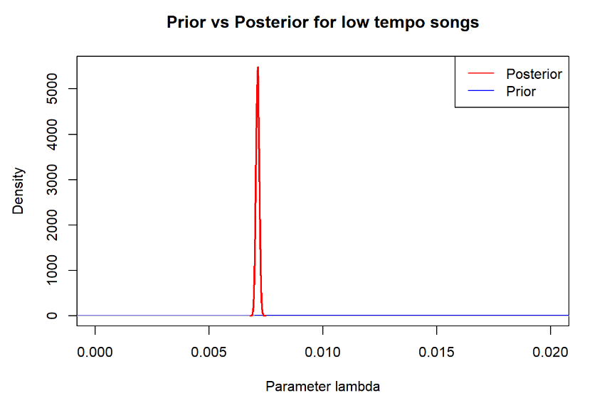

# Song Tempo Analysis Using Metrop

Garrett Springer and Jaden Earl

## Introduction

What makes popular songs popular? We decided to test that question by comparing the streams of songs that have fast tempo vs slow tempo. This will give insight to songwriters who want to make popular songs.

## Methods

Data comes from the kaggle dataset "Spotify and Youtube", which took top artists top 10 songs and recorded the number of streams and views that each song has had over the last 20 years. Since the number of streams is a count with a strong right-tail decay we choose the exponential distribution. We broke our data up by filtering the songs that had greater that 120 bpm tempo as high tempo songs, and less than 120 bpm as low tempo songs (this break at 120 bpm was chosen by taking the average tempo of all songs, which was 120.607.

We changed the number of streams to be in millions of streams to make it easier to work with. The parameter in an exponential is $\lambda$ and the mean and variance are as follows $mean = \frac{1}{\lambda} \ \ \ \ var = \frac{1}{\lambda^2} \ \ \ \ (sd = 1/\lambda)$ We have a mean of f 138.6636653 which means that we should use a lambda of .0072 which means that our standard deviation should be the same as the mean (138) but our data standard deviation is 248.2687295. This could potentially be a problem because we will under predict the standard deviation. But for simplicity we will continue to use the exponential distribution model. From now on we will call $\lambda$ $\theta$.

Our prior for $\theta_{high}$ is $UN(\frac 1{240}, \frac 1{60})$ and $\theta_{low}$ is $UN(\frac 1 {190}, \frac1 {10})$ because we think that our mean is somewhere between 60 and 240 million streams for $\theta_{high}$ and between 10 and 190 million streams for $\theta_{low}$ and we chose a uniform distribution because we are not sure where to weight our priors. The assumption in our prior made here is that there is a difference between the distribution high tempo songs number of streams and low tempo songs number of streams with high tempo songs being more popular.

Since the complete conditional is difficult to analytically derive we will be using the metropolis algorithim to formulate the posteriors.

Data: [kaggle/spotify](https://www.kaggle.com/datasets/salvatorerastelli/spotify-and-youtube)

## Results

We plotted a histogram of our data alongside an exponential distribution using the mean of the data overall to show that an exponential distribution is approximately appropriate distribution for this problem. As noted below in the discussion section, a gamma distribution might more appropriately match the data.


We run the metropolis algorithm to get draws for our thetas for low and high tempo songs. The mean of the draws for the low tempo songs is 0.007 and the mean for the draws of the high tempo songs is 0.007 and below is the plot of the posterior distributions of our high tempo songs and low tempo songs


Contrary to our prior beliefs the data suggests that high tempo songs have a slightly higher $\theta$ than low tempo songs (this is not backed up with a 95% probability interval though).

### Low Tempo Songs Post vs Prior



There is a 95% probability that the lambda parameter for low tempo songs is between 0.007 and 0.0073.

The large data set here allows the posterior to be extremely informative as compared to the prior (hence why the prior looks like a flat line at the bottom of the plot).

### High tempo songs Post vs Prior


There is a 95% probability that the lambda parameter for high tempo songs is between 0.0072 and 0.0074.

The large data set here allows the posterior to be extremely informative as compared to the prior (hence why the prior looks like a flat line at the bottom of the plot).

## Posterior Inference

### Answering the primary research question

We take the ratio between $\theta_{high}$ and $\theta_{low}$, such that $\frac {\theta_{high}}{\theta_{low}}$ to test our research hypothesis that high tempo and low tempo songs have different $\theta$ parameters. We take the ratio instead of a pure difference because the support is for $\theta > 0$.


There is a 95% probability that the ratio between high tempo songs lambda parameter and the low tempo songs lambda parameter is between .9904 and 1.052. That credible interval contains 1 indicating that there is no statistical evidence that high tempo and low tempo songs have different $\theta$ parameters for their number of streams.

## Discussion

Based on our credible intervals we cannot conclude that there is a significant difference between the number of streams of high tempo songs (over 120 bpm) and the streams of low tempo songs (under 120 bpm) because the distribution significantly overlap. Interestingly the data suggested that low tempo songs might have a slightly smaller $\theta$ parameter (not significantly smaller with 95% probability intervals), this goes contrary to our prior beliefs that high tempo songs would have more streams.

This model could have been improved by utilizing the gamma distribution instead of an exponential to model the data. The data didn't quite match the assumptions that the mean would equal it's variance, and the amount of songs that are produced with very little streams is very high. Another improvement could have been made in the grouping of high tempo and low tempo songs. The cutoff we used for tempo (120 bpm) was very arbitrarily chosen. It might have beem more useful instead to model the relationship between song tempo and the amount of streams as linear regression problem.

## Appendix

```{r,
Spotify <- read_csv("Spotify_Youtube.csv")
Spotify <- drop_na(Spotify)

mean(Spotify$Tempo)
median(Spotify$Tempo)
summary(Spotify$Stream)

Spotify <- Spotify %>% 
  mutate(logStreams = log(Stream)) %>% 
  mutate(streams_mil = Stream/1000000)
        
highTempoSongs <- filter(Spotify, Tempo > 120)
lowTempoSongs <- filter(Spotify, Tempo <= 120)
```

```{r,
hist(Spotify$streams_mil, probability = T, ylim = c(0, .008), breaks = 48, xlim = c(0, 1500), 
     xlab = "Streams (millions)", 
     main = "Histogram of data and an Exponential distribution")
lines(density(rexp(1000000, rate = 1/mean(Spotify$streams_mil)), adjust = 2), type= 'l', lwd = 3, col = 'blue')
```

```{r,
lgtheta_high <- function(x){
  sum(dexp(highTempoSongs$streams_mil, rate = x, log = T)) + dunif(x, min = 1/240, max = 1/60, log = T)
}
theta_vec_high <- numeric()
theta_vec_high[1] <- .008

J <- 10000
j <- 2

tuning_param <- .0004

for(j in 2:J){

  #cat("j:", j, '\n')
  tp <- rnorm(1, theta_vec_high[j-1], tuning_param)
  
  theta_vec_high[j] <- theta_vec_high[j-1]
  
  #cat("proposed:", tp, '\n', "current:", theta_vec_low[j], "\n")
  
  if(tp > 1/240 & tp < 1/60){
  
    alpha <- min(1, exp(lgtheta_high(tp) - lgtheta_high(theta_vec_high[j-1])))
  
    if(runif(1) < alpha) theta_vec_high[j] <- tp
  }
}
```

```{r,
# Acceptance rate
1-mean(diff(theta_vec_high) == 0)

burn <- 1:500

theta_vec_high <- theta_vec_high[-burn]

keep <- seq(0, length(theta_vec_high) - 1, by = 10)+1

par(mfrow = c(1, 2))
plot(theta_vec_high[keep], type= 'l', main = "mixing", ylab = "parameter val")
acf(theta_vec_high[keep], main = "auto-corr. low tempo")
```

```{r,
lgtheta_low <- function(x){
  sum(dexp(lowTempoSongs$streams_mil, rate = x, log = T)) + dunif(x, min = 1/190, max = 1/10, log = T)
}
theta_vec_low <- numeric()
theta_vec_low[1] <- .008

J <- 100000

tuning_param <- .0004

for(j in 2:J){
  
  #cat("j:", j, '\n')
  tp <- rnorm(1, theta_vec_low[j-1], tuning_param)
  
  theta_vec_low[j] <- theta_vec_low[j-1]
  
  #cat("proposed:", tp, '\n', "current:", theta_vec_low[j], "\n")
  
  if(tp > 1/190 & tp < 1/10){
  
    alpha <- min(1, exp(lgtheta_low(tp) - lgtheta_low(theta_vec_low[j-1])))
  
    if(runif(1) < alpha) theta_vec_low[j] <- tp
  
  }
  

}
```

```{r,
# Acceptance rate
1-mean(diff(theta_vec_low) == 0)

burn <- 1:500

theta_vec_low <- theta_vec_low[-burn]

keep <- seq(0, length(theta_vec_low) - 1, by = 10)+1

par(mfrow = c(1, 2))
plot(theta_vec_low[keep], type= 'l', main = "mixing", ylab = "parameter val")
acf(theta_vec_low[keep], main = "auto-corr. low tempo")

```

```{r,
#Different posterior plots
plot(density(theta_vec_high, adjust = 2), col = 'red', ylim = c(0,6000), main = "Posterior Parameter, for high and low tempo songs", xlab = "Lambda Parameter")
lines(density(theta_vec_low, adjust = 2), col = 'blue')
legend("topright", legend = c("high tempo", "low tempo"), col = c("red", "blue"), lty = 1)
```

```{r,
thetasLow <- runif(100000, min = 1/190, max = 1/10)

plot(density(thetasLow, adjust = 2), col = 'blue', ylim = c(0, 5500), xlim = c(0,0.02), main = "Prior vs Posterior for high tempo songs", xlab = "Parameter lambda")
lines(density(theta_vec_low, adjust = 2), col = 'red', lwd = 2)
legend("topright", legend = c("Posterior", "Prior"), col = c("red", "blue"), lty = 1)

# 95% probability interval of High posterior
quantile(theta_vec_low, c(0.025, 0.975))
```

```{r,
thetasHigh<- runif(100000, min = 1/260, max = 1/60)

plot(density(thetasHigh, adjust = 1), col = 'blue', ylim = c(0, 5500), main = "Prior vs Posterior for high tempo songs", xlab = "Parameter lambda")
lines(density(theta_vec_high, adjust = 1), col = 'red', lwd = 2)
legend("topright", legend = c("Posterior", "Prior"), col = c("red", "blue"), lty = 1)

# 95% probability interval of High posterior
quantile(theta_vec_high, c(0.025, 0.975))
```

```{r,

diff <- theta_vec_high/theta_vec_low

#Ratio between high Lambda and low Lambda
plot(density(diff, adjust = 3), lwd = 3)
lines(density(diff), col = 'green')
abline(v = 1, col = 'red')
legend("topright", legend = c("adjusted diff. density", "diff. density", "rates are equal"), col = c("black", "green", "red"), lwd = c(3, 1, 1), lty = 1)


#Difference in Posterior Predictives
plot(density(rexp(100000, rate = theta_vec_high)), lwd = 1, col = 'red', main = "Posterior Predictive, for high(red) and low(black) tempo song streams", xlab = "Streams in Millions")
lines(density(rexp(100000, rate = theta_vec_low)), lwd = 1)
legend("topright", legend = c("high tempo", "low tempo"), col = c("red", "black"), lty = 1)


diff <- theta_vec_high/theta_vec_low
# 95% probability interval of differences
quantile(diff, c(0.025, 0.975))
## 0.9945,  1.0519952 
```
