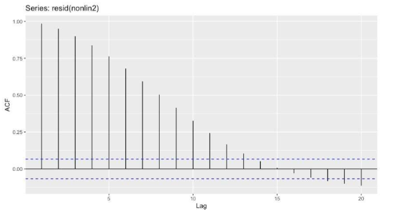
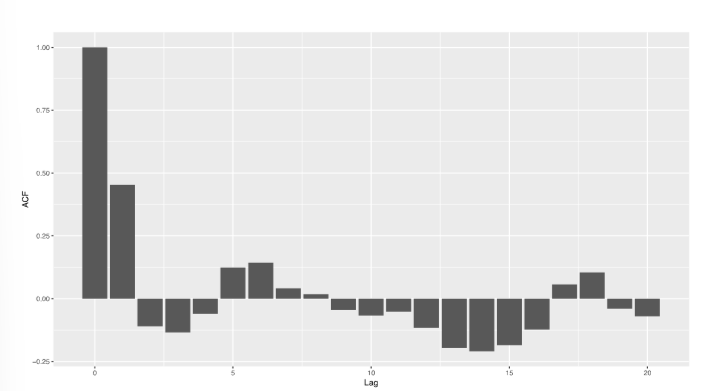

# Time Series

## Autoregressive (AR) model

$$
\epsilon = MNV(0, \sigma^2\mathbf{R})\\ \epsilon_t = \sum_{l = 1}^{p}\phi_l\epsilon_{t-l} + w_t \;\;w_t \sim N(0, \sigma^2_\epsilon)
$$

p = number of autoregressive time points to go back

this example would be p is about 12

## Moving Average (MA) model

$$
\epsilon = MNV(0, \sigma^2\mathbf{R})\\ \epsilon_t = \sum_{l = 1}^{q}\theta_lw_{t-l} + w_t \;\;w_t \sim^{iid} N(0, \sigma^2_\epsilon)
$$

q = number of time points back

in this example q would be 1

## Transformations

Differencing in time series

$$
seasonal:\;\epsilon_t - \epsilon_{t-S} = d_t \\\epsilon_t - \epsilon_{t-1} = d_t
$$

where d are now a new time series and S is the season length

## Seasonal Autoregresive Integreated Moving Average (SARIMA) model

SARIMA(p,d,q,P,D,Q)s

* p - autogressive order
* d - differencing order in time (did we do a transformation)
* q - moving average order
* P - seasonal p
* D - seasonal d
* Q - seasonal q
* s - seasonal time period

## Time series model summary

$$
y = \mathbf{X}\mathbf{\beta} + \mathbf{\epsilon}\\
\epsilon = SARIMA(p,d,q,P,D,Q)_s
$$
